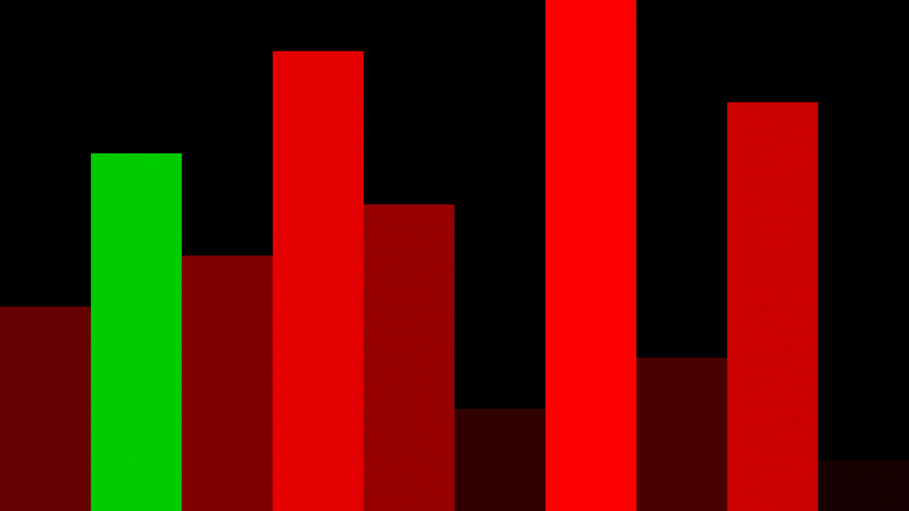
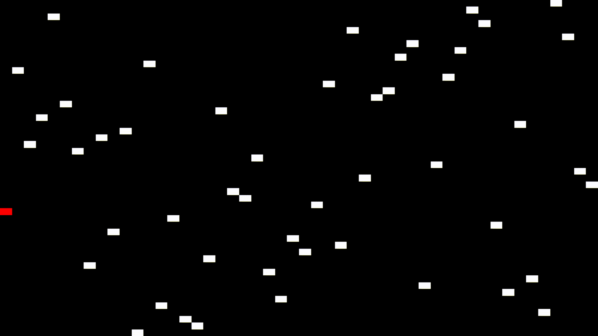

# SortVisualiser
A project made for educational purposes(for myself).

# Examples







# How to build
First of all, you should have [conan](https://conan.io/downloads.html) and [CMake](https://cmake.org/download/) installed.
After that it's pretty simple:
```sh
mkdir build && cd build
conan install ..
cmake -DCMAKE_BUILD_TYPE=Release ..
cmake --build .
cd src/
# Now you can run ./SortVisualiser
```

However, from personal experience, on Linux conan's SDL2 doesn't want to play audio, so you might build SDL2 from source.
To do that, remove `FindSDL2.cmake` from your build dir and tell CMake where SDL2 is:
```sh
# Same as before
rm FindSDL2.cmake
SDL2_DIR=${SDL2_PATH} cmake -DCMAKE_BUILD_TYPE=Release ..
# Same as before
```
Where SDL2_PATH is the path where your build of SDL2 is located, more specifically the folder where `sdl2-config.cmake` is found.

To build for development:
```sh
cmake -DENABLE_SANITIZER_ADDRESS=ON \
      -DENABLE_SANITIZER_UNDEFINED=ON \
      -DBUILD_TESTS=ON \
      ..
```

# How to use
You can `./SortVisualiser --help` to see what the flags are. For example, to recreate the examples shown in this readme(in order):
```sh
./SortVisualiser --algorithm=count_sort --size=50
./SortVisualiser
./SortVisualiser --algorithm=insertion_sort
./SortVisualiser --algorithm=radix_sort_simple --size=100
./SortVisualiser --algorithm=quicksort --size=100 --color=blue
./SortVisualiser --algorithm=merge_sort --size=100 --color=white --highlight-color=red --type=point
```

Of course, to see the full set of options, the easiest way is to just check [main.cpp](./src/main.cpp).
